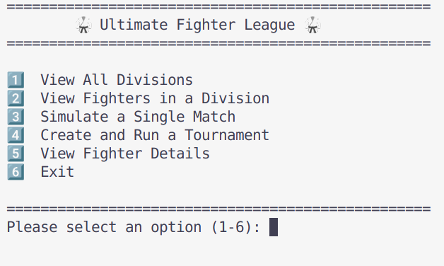

# Ultimate Fighter League 🥋

A terminal-based Java simulation for managing UFC divisions, exploring fighter statistics, and running custom tournaments. Designed as a local simulation tool without modifying real-world rankings or fighter data.

## Features ✨

- 🧑‍💻 View top 15 ranked fighters in each UFC division.
- 🔍 Inspect detailed stats and profiles of any fighter.
- 🏆 Create and simulate tournaments (4, 8, or 16 fighters).
- 🎲 Random or ordered tournament seeding.
- 📊 Terminal-based interactive menu with user-friendly navigation.

### Project Structure 🧱 

Ultimate-Fighter-League/
├── data/
│   └── ufc-fighters-statistics.csv
├── src/
│   ├── app/
│   │   └── Main.java
│   ├── models/
│   │   ├── Fighter.java
│   │   ├── Match.java
│   │   └── Tournament.java
│   ├── services/
│   │   ├── DivisionManager.java
│   │   ├── MatchService.java
│   │   ├── TournamentService.java
│   │   └── UFLMenuManager.java
│   └── utils/
│       └── DataLoader.java

### Requirements 📦

- Java 17+
- GNU Make (for using the provided Makefile)

### Building the Project 🛠️ 

To compile the project:
    make
To run the application:
    make run
To clean compiled files:
    make clean

### Fighter Data Source 📋 

All fighter information is loaded from the file:
    *** data/ufc-fighters-statistics.csv ***

This CSV contains detailed stats for UFC fighters such as:

- Full name and nickname  
- Height, weight, reach, and stance  
- Date of birth  
- Striking and grappling statistics  
- Win–loss–draw record  

The application uses this file at runtime to populate the divisions and fighter profiles. **Do not modify or rename the file**, as it may cause loading errors.

## How to Use the App 🚀 

After building the project with `make run`, follow the interactive terminal menu to navigate the application:

### Main Menu Options 🧭 

### Viewing Fighters 🔍 
- Choose option `1` to see all the divisions available.
- Choose option `2` to browse fighters by division, including champions and ranked contenders.
- Choose option `5` to see detailed stats of a specific fighter (you’ll select them by their ranking within a division).

### Simulate a Match 🥊
- Choose option `3` to simulate a single match between two fighters.
- You’ll pick fighters manually from their divisions, and the result will be calculated automatically.

### Running a Tournament 🏆
- Choose option `4` to create a tournament with 4, 8, or 16 fighters.
- You can choose to **shuffle** fighters or keep their **original order**.
- Matches are simulated round by round until a champion is crowned.
- The full bracket, including match results, is displayed at the end.

### Exiting the Program 🚪
- At any point, follow on-screen prompts and press `[Enter]` to return to the main menu.
- Choose option `6` to exit the application.

## License 📄

This project is open-source.  
Feel free to use, modify, and distribute it with proper attribution.

## Author 🧑‍💻

Created by Carlos Mancillas.  
If you enjoyed this project or found it useful, feel free to ⭐ the repo or reach out!

## Version 📌

This is version **1.0.0** of the project.  
Future improvements may include match history persistence, ranking logic, and GUI support.

